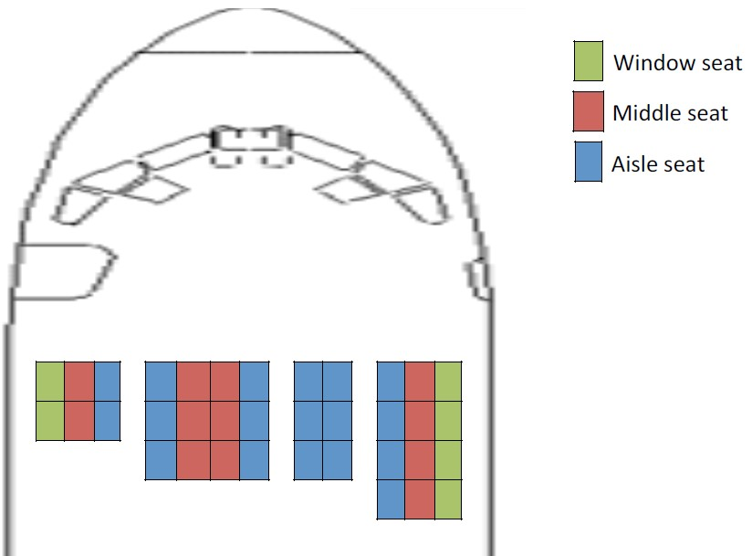
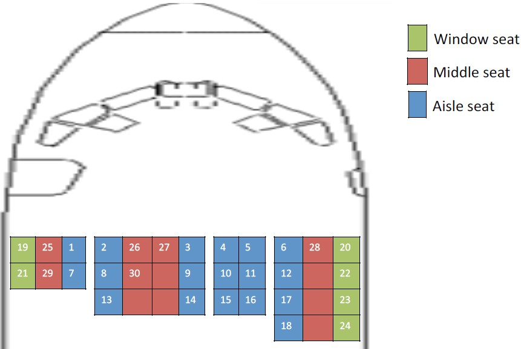

# Airplane Seating

This is a Node.js program that helps seat audiences in a flight based on the following inputs and rules.

## Rules for seating

• Always seat passengers starting from the front row to back, starting from the left to the right.
• Fill aisle seats first, followed by window seats, followed by center seats

## Inputs:

Program inputs are in the config.js file. First input airplaneSeatBlocks is a 2D array that represents the columns and rows. <br>
Ex: [[3,4],[4,5],[2,3],[3,4]] array represents columns and rows like this:<br>


Second input is passengers list which is names or ID or ticket number of passengers waiting in queue <br>
Ex: If there were 30 ticket numbers of passengers which are 1 to 30 waiting in the queue, passengers array must be like this:<br> [1, 2, 3, 4, 5, 6, 7, 8, 9, 10, 11, 12, 13, 14, 15, 16, 17, 18, 19, 20, 21, 22, 23, 24, 25, 26, 27, 28, 29, 30];<br>
The seating output will be like this:


## Using

#### Clone the project on your local drive and run with Node.js

```sh
$ git clone https://github.com/mevlutarikan/ecommerce.git
$ cd airplane-seating/
$ node app.js
```

## Time&Space complexity

if n is the total number of seats in the plane, both time and space complexity is O(n).
